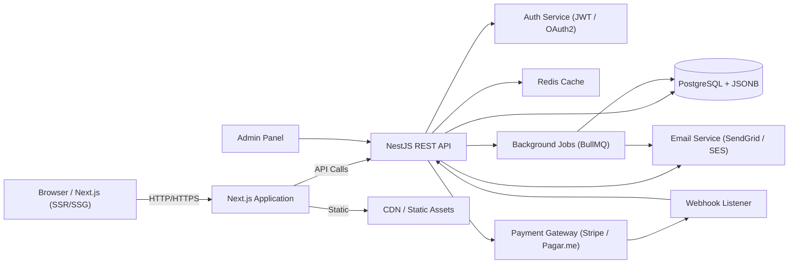
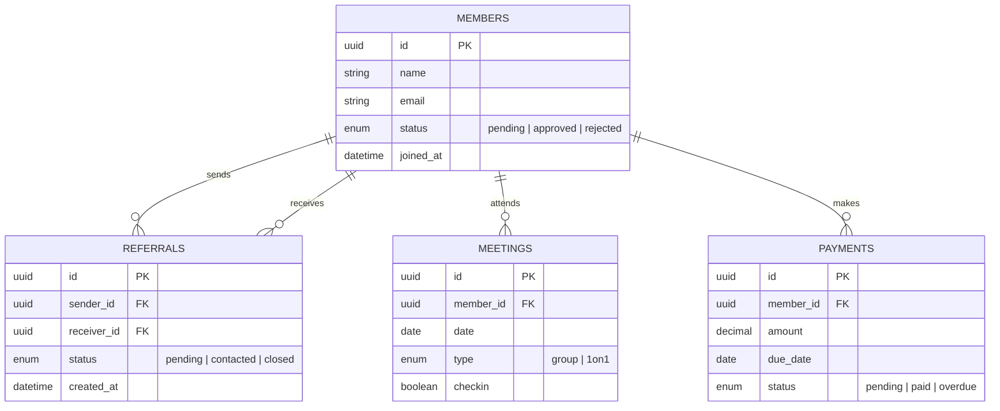

# Networking Platform - Architecture Design Document

## 1. Overview

The **Networking Platform** is a fullstack web application designed to manage professional networking groups. It enables efficient **member management**, **business referrals**, **event participation**, and **performance tracking** through a unified system.

The MVP will be implemented as a **monorepo** managed by **pnpm**, structured as follows:

```
networking-platform/
├── client/   → Frontend (Next.js + TypeScript)
├── server/   → Backend (NestJS + TypeScript)
├── shared/   → Shared types/interfaces (optional)
├── pnpm-workspace.yaml
├── package.json
└── README.md
```

---

## 2. Functional Scope

### 2.1 Member Management

* Public form for participation requests.
* Admin dashboard to approve or reject requests.
* Full registration form for approved members.

### 2.2 Communication and Engagement

* Announcement board for group-wide updates.
* Meeting attendance tracking (check-in system).

### 2.3 Business Generation

* Business referral system between members.
* Tracking of referral progress (pending, contacted, closed).
* Public “thank you” records for completed deals.

### 2.4 Performance and Reporting

* 1-on-1 meeting tracking.
* Dashboards for individual and group metrics.
* Periodic reports (weekly, monthly, cumulative).

### 2.5 Financial Management

* Monthly subscription tracking (generation, payment status).

---

## 3. Architecture Diagram



---

## 4. Data Model (Relational)

### 4.1 Entity Relationship Diagram



### 4.2 Database Choice

**PostgreSQL** was chosen for its relational structure, strong ACID compliance, and support for JSONB fields—ideal for flexible data (form metadata, referrals) while maintaining integrity and query performance.

### 4.3. Technical Schema (Simplified SQL Reference)
```sql

CREATE TABLE users (
  id UUID PRIMARY KEY DEFAULT gen_random_uuid(),
  email TEXT UNIQUE NOT NULL,
  password_hash TEXT,
  name TEXT,
  role TEXT NOT NULL DEFAULT 'member', -- admin, member, reviewer
  created_at TIMESTAMPTZ DEFAULT now()
);

CREATE TABLE member_applications (
  id UUID PRIMARY KEY DEFAULT gen_random_uuid(),
  applicant_name TEXT NOT NULL,
  email TEXT NOT NULL,
  phone TEXT,
  message TEXT,
  status TEXT NOT NULL DEFAULT 'pending', -- pending, approved, rejected
  reviewed_by UUID REFERENCES users(id),
  reviewed_at TIMESTAMPTZ,
  created_at TIMESTAMPTZ DEFAULT now(),
  metadata JSONB
);

CREATE TABLE members (
  id UUID PRIMARY KEY DEFAULT gen_random_uuid(),
  user_id UUID REFERENCES users(id),
  join_date DATE DEFAULT CURRENT_DATE,
  membership_status TEXT DEFAULT 'active', -- active, paused, cancelled
  profile JSONB,
  created_at TIMESTAMPTZ DEFAULT now()
);

CREATE TABLE events (
  id UUID PRIMARY KEY DEFAULT gen_random_uuid(),
  title TEXT NOT NULL,
  description TEXT,
  event_date TIMESTAMPTZ NOT NULL,
  location TEXT,
  organizer_id UUID REFERENCES users(id),
  created_at TIMESTAMPTZ DEFAULT now(),
  metadata JSONB
);

CREATE TABLE attendance (
  id UUID PRIMARY KEY DEFAULT gen_random_uuid(),
  event_id UUID REFERENCES events(id) ON DELETE CASCADE,
  member_id UUID REFERENCES members(id) ON DELETE CASCADE,
  checkin_at TIMESTAMPTZ,
  status TEXT DEFAULT 'present', -- present, absent, late, excused
  created_at TIMESTAMPTZ DEFAULT now()
);

CREATE TABLE referrals (
  id UUID PRIMARY KEY DEFAULT gen_random_uuid(),
  from_member UUID REFERENCES members(id),
  to_member UUID REFERENCES members(id),
  referred_person JSONB, -- {name, company, contact, notes}
  value NUMERIC,
  status TEXT DEFAULT 'open', -- open, contacted, qualified, won, lost
  status_history JSONB, -- [{status, by, at, comment}]
  created_at TIMESTAMPTZ DEFAULT now()
);

CREATE TABLE thanks_records (
  id UUID PRIMARY KEY DEFAULT gen_random_uuid(),
  from_member UUID REFERENCES members(id),
  to_member UUID REFERENCES members(id),
  referral_id UUID REFERENCES referrals(id),
  message TEXT,
  created_at TIMESTAMPTZ DEFAULT now()
);

CREATE TABLE one_on_one_meetings (
  id UUID PRIMARY KEY DEFAULT gen_random_uuid(),
  member_a UUID REFERENCES members(id),
  member_b UUID REFERENCES members(id),
  scheduled_at TIMESTAMPTZ,
  notes TEXT,
  status TEXT DEFAULT 'scheduled',
  created_at TIMESTAMPTZ DEFAULT now()
);

CREATE TABLE invoices (
  id UUID PRIMARY KEY DEFAULT gen_random_uuid(),
  member_id UUID REFERENCES members(id),
  due_date DATE,
  amount_cents INTEGER NOT NULL,
  currency TEXT DEFAULT 'BRL',
  status TEXT DEFAULT 'pending', -- pending, paid, overdue, cancelled
  external_payment_id TEXT,
  metadata JSONB,
  created_at TIMESTAMPTZ DEFAULT now()
);

CREATE TABLE payments (
  id UUID PRIMARY KEY DEFAULT gen_random_uuid(),
  invoice_id UUID REFERENCES invoices(id),
  paid_at TIMESTAMPTZ,
  amount_cents INTEGER,
  gateway TEXT,
  gateway_payload JSONB,
  created_at TIMESTAMPTZ DEFAULT now()
);

CREATE INDEX ON member_applications (status);
CREATE INDEX ON events (event_date);
CREATE INDEX ON referrals (status);
CREATE INDEX USING GIN (members.profile);
CREATE INDEX USING GIN (referrals.referred_person);
```
### 4.4 Relacionamentos (summary)
  - users ↔ members (optional 1:1)
  - **member_applications** -> when approved, they generate both **users** and **members**
  - **members have** a **1–N** relationship with **events** through **attendance**
  - **members** have a **1–N** relationship with **referrals** (as sender) and possibly as receiver
  - **invoices** and **payments** link financial data to the **member**

---

## 5. Frontend Structure (Next.js)

**Stack:** Next.js (App Router) + React + TypeScript + TailwindCSS + Server components (for data fetching).

**Suggested Folder Structure:**

```
client/
└── src/
    ├── app/                      # Next App Router pages (routes)
    │   ├── layout.tsx
    │   ├── page.tsx
    │   ├── members/
    │   │   ├── page.tsx
    │   │   └── [id]/page.tsx
    │   ├── events/
    │   ├── referrals/
    │   └── admin/
    ├── components/
    │   ├── ui/                    # atoms/primitives (Button, Modal, Input, Table)
    │   ├── members/               # MemberCard, MemberForm, MemberList
    │   ├── events/                # EventCard, CheckInPanel
    │   └── referrals/             # ReferralForm, ReferralBoard
    ├── hooks/                     # useAuth, useSocket, usePagination
    ├── services/                  # api.ts (axios/fetch wrapper), auth.ts
    ├── contexts/                  # AuthContext, ToastContext
    ├── lib/                       # date utils, validators
    └── types/                     # shared TS types/interfaces
```

---

## 6. Backend Structure (NestJS)

**Stack:** NestJS, Prisma, PostgreSQL, class-validator, Swagger.

**Module Organization:**

```
server/
├── src/
│   ├── main.ts                         # App entry point
│   ├── app.module.ts                   # Root module
│   │
│   ├── common/                         # Shared utilities (pipes, guards, interceptors)
│   │   ├── decorators/
│   │   ├── dto/
│   │   ├── filters/
│   │   ├── guards/
│   │   └── interceptors/
│   │
│   ├── config/                         # Env config & validation
│   │   ├── config.module.ts
│   │   ├── database.config.ts
│   │   └── env.validation.ts
│   │
│   ├── database/                       # Prisma or TypeORM configuration
│   │   ├── prisma.service.ts
│   │   └── seed/
│   │
│   ├── auth/                           # Authentication & authorization
│   │   ├── auth.module.ts
│   │   ├── auth.controller.ts
│   │   ├── auth.service.ts
│   │   ├── strategies/
│   │   │   ├── jwt.strategy.ts
│   │   │   └── local.strategy.ts
│   │   └── dto/
│   │       ├── login.dto.ts
│   │       └── register.dto.ts
│   │
│   ├── users/                          # User entity (1:1 with members)
│   │   ├── users.module.ts
│   │   ├── users.controller.ts
│   │   ├── users.service.ts
│   │   ├── entities/
│   │   │   └── user.entity.ts
│   │   └── dto/
│   │       ├── create-user.dto.ts
│   │       └── update-user.dto.ts
│   │
│   ├── members/                        # Member management
│   │   ├── members.module.ts
│   │   ├── members.controller.ts
│   │   ├── members.service.ts
│   │   ├── entities/
│   │   │   └── member.entity.ts
│   │   └── dto/
│   │       ├── create-member.dto.ts
│   │       └── update-member.dto.ts
│   │
│   ├── referrals/                      # Business referrals between members
│   │   ├── referrals.module.ts
│   │   ├── referrals.controller.ts
│   │   ├── referrals.service.ts
│   │   ├── entities/
│   │   │   └── referral.entity.ts
│   │   └── dto/
│   │       ├── create-referral.dto.ts
│   │       └── update-referral.dto.ts
│   │
│   ├── payments/                       # Financial module (invoices, payments)
│   │   ├── payments.module.ts
│   │   ├── payments.controller.ts
│   │   ├── payments.service.ts
│   │   ├── entities/
│   │   │   ├── invoice.entity.ts
│   │   │   └── payment.entity.ts
│   │   └── dto/
│   │       ├── create-payment.dto.ts
│   │       └── update-payment.dto.ts
│   │
│   └── events/                         # Events, check-ins, and attendance
│       ├── events.module.ts
│       ├── events.controller.ts
│       ├── events.service.ts
│       ├── entities/
│       │   └── event.entity.ts
│       └── dto/
│           ├── create-event.dto.ts
│           └── update-event.dto.ts
│
├── test/                               # e2e or unit tests
│   └── app.e2e-spec.ts
│
├── prisma/                             # Prisma schema (if applicable)
│   └── schema.prisma
│
├── .env.example
├── package.json
└── tsconfig.json
```

**Guidelines:**

* Each feature = independent module (controller + service + entity)
* Use DTOs for validation
* Implement guards/interceptors for auth & logging

---

## 7. API Definition (REST)

### 7.1 Conventions

**Base path:** `/api`

#### HTTP Status Codes

| Code | Status               | Description                             |
| ---- | -------------------- | --------------------------------------- |
| 200  | OK                   | Request processed successfully          |
| 201  | Created              | Resource created successfully           |
| 204  | No Content           | Request processed, no response body     |
| 400  | Bad Request          | Invalid parameters or payload           |
| 401  | Unauthorized         | Missing or invalid authentication token |
| 403  | Forbidden            | Authenticated but lacks permission      |
| 404  | Not Found            | Resource not found                      |
| 422  | Unprocessable Entity | Validation or semantic error            |
| 500  | Server Error         | Unexpected internal issue               |

#### Pagination & Filtering

* **Pagination:** `?page=1&limit=20`
* **Filtering:** query params, e.g. `?status=active&sort=created_at:desc`

---

### 7.2 API Examples

#### (1) Member Management

**POST /api/members/apply** — Create participation request
**Request Body:**

```json
{
  "name": "Alice Johnson",
  "email": "alice@example.com",
  "phone": "+55 11 99999-9999",
  "message": "I'd like to join the group."
}
```

**Response (201):**

```json
{
  "id": "uuid",
  "status": "pending",
  "created_at": "2025-11-06T10:00:00Z"
}
```

**PATCH /api/members/:id/status** — Approve or reject member
**Request Body:**

```json
{
  "status": "approved"
}
```

**Response (200):**

```json
{
  "id": "uuid",
  "status": "approved",
  "updated_at": "2025-11-06T12:00:00Z"
}
```

---

#### (2) Referrals

**POST /api/referrals** — Create a new referral
**Request Body:**

```json
{
  "from_member_id": "uuid-1",
  "to_member_id": "uuid-2",
  "referred_person": {
    "name": "Carlos Lima",
    "company": "Lima Consulting",
    "contact": "carlos@lima.com"
  },
  "value": 3000
}
```

**Response (201):**

```json
{
  "id": "uuid",
  "status": "open",
  "created_at": "2025-11-06T12:30:00Z"
}
```

**PATCH /api/referrals/:id/status** — Update referral status
**Request Body:**

```json
{
  "status": "closed"
}
```

**Response (200):**

```json
{
  "id": "uuid",
  "status": "closed",
  "updated_at": "2025-11-06T13:00:00Z"
}
```

---

#### (3) Payments

**GET /api/payments/:memberId** — Retrieve member payment history
**Response (200):**

```json
[
  {
    "id": "uuid",
    "amount": 250.00,
    "due_date": "2025-12-01",
    "status": "paid"
  }
]
```

**POST /api/payments/generate** — Generate monthly invoices
**Request Body:**

```json
{
  "month": "2025-12",
  "amount": 250.00
}
```

**Response (201):**

```json
{
  "generated": 52,
  "status": "success"
}
```

---

## 8. Summary

This document defines the architecture, data model, frontend and backend organization, and REST API structure for the **Networking Platform** MVP.
It can serve as both a **technical reference** and a **foundation** for incremental development using **NestJS + Next.js + PostgreSQL** in a **pnpm monorepo** environment.
